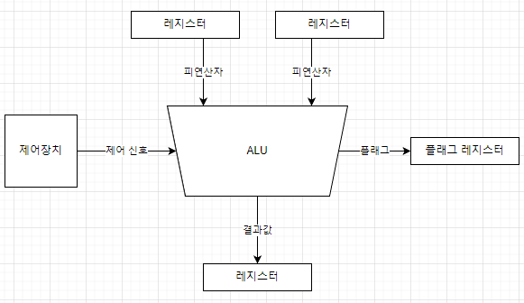

# Week 01 - Computer Architecture + OS Runtime

---

## 제출 기준

- 필수 답변: COMMON-001 ~ COMMON-020
- 선택 답변: COMMON-021 ~ COMMON-040

---

## 필수 질문

## [COMMON-001] CPU의 주요 구성 요소인 ALU, 제어장치, 레지스터에 대해 설명해 주세요.

답변:
- ALU(산술논리장치): 덧셈·뺄셈 등의 산술 연산과 AND·OR·비교 등의 논리 연산을 수행한다.
- 제어장치: 명령어를 해석하고, 각 장치에 무엇을 언제 수행할지 제어 신호를 보낸다.
- 레지스터: CPU 내부에서 명령어, 주소, 연산 대상과 결과를 잠시 보관하는 매우 빠르고 작은 저장 공간이다.

제어장치가 작업을 지시하고, 레지스터가 필요한 값을 제공하며, ALU가 실제 계산을 수행한다.
예시) 3 + 5를 계산한다면, 레지스터에 3과 5를 저장하고 → 제어장치가 덧셈을 지시하고 → ALU가 계산한 8을 다시 레지스터에 저장합니다.

참고 자료: https://rebugs.tistory.com/192

---

## [COMMON-002] 명령어 사이클이 무엇인지 Fetch, Decode, Execute 단계로 설명해 주세요.

답변:
명령어 사이클은 CPU가 하나의 명령어를 처리하는 반복 과정입니다.
- Fetch(인출): 메모리에서 실행할 명령어를 가져옵니다.
- Decode(해석): 제어장치가 가져온 명령어가 무엇을 의미하는지 해석합니다.
- Execute(실행): 해석한 내용에 따라 ALU 등이 실제 작업을 수행합니다.
- CPU는 프로그램이 실행되는 동안 이 과정을 반복합니다.
예시 ) CPU가 명령어를 메모리에서 가져오고(Fetch), 덧셈 명령이라는 것을 파악한 뒤(Decode), ALU가 3과 5를 더합니다(Execute).

참고 자료: https://www.cs.uni.edu/~schafer/cohort26/FCCS/lessons/week2/topic2e/t2e_r2_fde.html

---

## [COMMON-003] 프로그램이 실행되기까지의 과정을 컴파일, 링킹, 로딩, 실행 흐름으로 설명해 주세요.

답변:
- 컴파일(Compile): 소스 코드를 컴퓨터가 이해할 수 있는 목적 코드로 번역합니다.
- 링킹(Linking): 여러 목적 파일과 라이브러리를 연결해 하나의 실행 파일을 만듭니다.
- 로딩(Loading): 운영체제가 실행 파일을 메모리에 올리고 실행 환경을 준비합니다.
- 실행(Execution): CPU가 메모리에 올라온 명령어를 하나씩 처리합니다.
예시 )
C 프로그램에서 printf()를 사용했다고 가정하면:
컴파일러가 작성한 C 코드를 목적 코드(기계어)로 번역합니다.
링커가 목적 코드와 printf()가 들어 있는 라이브러리를 연결합니다.
프로그램을 실행하면 운영체제가 실행 파일을 메모리에 올립니다.
CPU가 메모리의 명령어를 실행해 화면에 문자열을 출력합니다.

참고 자료: https://ko.wikipedia.org/wiki/%EC%BB%B4%ED%8C%8C%EC%9D%BC%EB%9F%AC, https://ko.wikipedia.org/wiki/%EB%A7%81%EC%BB%A4_(%EC%BB%B4%ED%93%A8%ED%8C%85)

---

## [COMMON-004] 컴파일 언어와 인터프리터 언어의 차이에 대해 설명해 주세요.

답변:
- 컴파일 언어는 프로그램을 실행하기 전에 소스 코드 전체를 기계어 또는 중간 코드로 변환합니다. 미리 변환하는 시간이 필요하지만, 컴파일된 결과를 실행하기 때문에 일반적으로 실행 속도가 빠릅니다. 대표적인 예로 C와 C++이 있습니다.
- 인터프리터 언어는 별도의 완성된 기계어 실행 파일을 미리 만들기보다, 프로그램을 실행하는 시점에 코드를 해석하며 실행합니다. 코드를 바로 실행하고 결과를 확인하기 편하지만, 실행 중에 해석 과정이 필요하므로 일반적으로 컴파일 방식보다 실행 속도가 느릴 수 있습니다. 대표적인 예로 Python이 있습니다.
- 다만 현대의 프로그래밍 언어는 두 방식을 함께 사용하기도 합니다. 예를 들어 Java는 소스 코드를 바이트코드로 컴파일한 뒤, JVM이 인터프리터와 JIT 컴파일러를 이용해 실행합니다.
참고 자료: https://dkswnkk.tistory.com/416

---

## [COMMON-005] JIT 컴파일이 무엇이고, 어떤 장점과 단점이 있는지 설명해 주세요.

답변:
- JIT(Just-In-Time) 컴파일은 프로그램 실행 중에 바이트코드나 중간 코드를 CPU가 직접 실행할 수 있는 기계어로 변환하는 방식입니다.
- Java의 JVM은 처음에는 바이트코드를 인터프리터로 실행하고, 자주 실행되는 코드를 JIT 컴파일러가 기계어로 변환하여 재사용합니다.
- 장점: 반복해서 실행되는 코드를 매번 해석하지 않아도 되므로 실행 성능이 향상됩니다.
- 단점: 프로그램 실행 초기에 코드를 분석하고 컴파일하는 시간이 필요하여 초기 실행 속도가 느릴 수 있습니다.
Java 프로그램의 반복문이나 자주 호출되는 메서드를 JVM이 기계어로 컴파일해 저장하면, 이후에는 같은 코드를 다시 해석하지 않고 바로 실행할 수 있습니다.
참고 자료: https://tech.kakaopay.com/post/jvm-warm-up/, https://dkswnkk.tistory.com/416

---

## [COMMON-006] 프로그램과 프로세스의 차이에 대해 설명해 주세요.

답변:
- 프로그램은 특정 작업을 수행하도록 작성되어 저장장치에 저장된 코드와 데이터의 집합입니다.
- 프로세스는 프로그램을 실행하여 운영체제로부터 메모리와 CPU 시간 등의 자원을 할당받은 동적인 실행 단위입니다.
예시) 저장장치에 설치된 계산기 애플리케이션은 프로그램이고, 계산기를 실행하여 메모리에 올라와 동작하고 있는 상태는 프로세스입니다. 계산기를 두 번 실행하면 같은 프로그램으로부터 서로 독립된 두 개의 프로세스가 생성될 수 있습니다.

참고 자료: https://wormwlrm.github.io/2021/10/04/OS-Restaurant.html, https://nathanh.tistory.com/133

---

## [COMMON-007] 프로세스와 스레드의 차이에 대해 설명해 주세요.

답변:
- 프로세스는 실행 중인 프로그램으로, 운영체제로부터 독립된 가상 주소 공간과 자원을 할당받는 실행 단위입니다.
- 스레드는 프로세스 안에서 명령어를 실행하는 흐름의 단위입니다.
- 같은 프로세스의 스레드들은 코드, 데이터, 힙 등의 자원을 공유하지만, 각자 프로그램 카운터, CPU 레지스터, 스택을 가집니다.
- 프로세스는 서로 격리되어 안정성이 높지만 데이터를 주고받으려면 IPC가 필요합니다. 스레드는 자원을 쉽게 공유할 수 있지만, 같은 데이터에 동시에 접근할 때 동기화 문제가 발생할 수 있습니다.
예시) 하나의 메신저 프로세스 안에서 화면 처리 스레드와 네트워크 통신 스레드가 함께 동작할 수 있습니다.

참고 자료: https://gmlwjd9405.github.io/2018/09/14/process-vs-thread.html, https://learn.microsoft.com/ko-kr/windows/win32/ProcThread/about-processes-and-threads

---

## [COMMON-008] PCB가 무엇이고, 운영체제가 PCB를 사용하는 이유를 설명해 주세요.

답변:
- PCB(Process Control Block)는 운영체제가 각 프로세스를 관리하기 위해 커널 영역에 유지하는 자료구조입니다.
- PCB에는 프로세스 ID, 상태, 프로그램 카운터, CPU 레지스터, 스케줄링 정보, 메모리 관리 정보, 입출력 상태 등이 저장됩니다.
- 운영체제는 PCB를 이용해 프로세스의 상태와 자원을 관리하고, 다음에 실행할 프로세스를 결정합니다.
- 컨텍스트 스위칭이 발생하면 현재 프로세스의 실행 상태를 PCB에 저장하고 다음 프로세스의 상태를 복원하므로, 중단된 프로세스가 나중에 이어서 실행될 수 있습니다.

참고 자료: https://junhyunny.github.io/information/operating-system/process-control-block-and-context-switching/, https://contents.kocw.net/KOCW/document/2015/cup/weonsunghyun/3.pdf

---

## [COMMON-009] 컨텍스트 스위칭이 무엇이고, 언제 발생하는지 설명해 주세요.

답변:
- 컨텍스트 스위칭은 CPU가 현재 실행 중인 프로세스나 스레드의 상태를 저장하고, 다음 작업의 상태를 복원하여 실행 대상을 바꾸는 과정입니다.
- 저장하고 복원하는 상태에는 프로그램 카운터, CPU 레지스터, 스택 포인터 등이 포함됩니다.
- 대표적으로 Time Slice가 끝났을 때, 현재 작업이 입출력이나 잠금을 기다릴 때, 더 높은 우선순위의 작업이 실행 가능해졌을 때 발생합니다.
- 상태를 저장하고 복원하는 동안에는 실제 사용자 작업을 수행하지 않으므로 오버헤드가 발생합니다.
- 인터럽트나 시스템 콜이 발생해도 운영체제가 다른 작업으로 실행 대상을 바꾸지 않았다면 컨텍스트 스위칭은 아닙니다.

참고 자료: https://junhyunny.github.io/information/operating-system/process-control-block-and-context-switching/, https://pages.cs.wisc.edu/~remzi/OSTEP/Korean/06-cpu-mechanisms.pdf

---

## [COMMON-010] 프로세스 컨텍스트 스위칭과 스레드 컨텍스트 스위칭의 차이에 대해 설명해 주세요.

답변:
- 두 방식 모두 현재 작업의 프로그램 카운터, CPU 레지스터, 스택 포인터 등을 저장하고 다음 작업의 상태를 복원합니다.
- 프로세스 컨텍스트 스위칭은 서로 다른 주소 공간 사이를 전환하므로 페이지 테이블과 같은 메모리 관리 정보도 변경해야 하며, TLB와 캐시에도 추가적인 영향을 줄 수 있습니다.
- 같은 프로세스 안의 스레드들은 주소 공간을 공유하므로 스레드 컨텍스트 스위칭에서는 주로 각 스레드의 레지스터와 스택 등의 실행 상태를 교체합니다.
- 따라서 일반적으로 같은 프로세스 내 스레드 컨텍스트 스위칭이 프로세스 컨텍스트 스위칭보다 비용이 작습니다.

참고 자료: https://easy-code-yo.tistory.com/31, https://pages.cs.wisc.edu/~remzi/OSTEP/Korean/26_threads-intro.pdf

---

## [COMMON-011] 운영체제의 유저 모드와 커널 모드를 구분하는 이유를 설명해 주세요.

답변:
- 유저 모드와 커널 모드는 시스템의 안정성과 보안을 위해 실행 권한을 구분한 CPU 모드입니다.
- 유저 모드에서는 일반 애플리케이션이 제한된 권한으로 실행되며, 커널 메모리나 하드웨어에 직접 접근하거나 특권 명령을 실행할 수 없습니다.
- 커널 모드에서는 운영체제가 전체 메모리와 하드웨어에 접근하고, 입출력과 메모리 관리 같은 핵심 작업을 수행할 수 있습니다.
- 사용자 프로그램은 보호된 기능이 필요할 때 시스템 콜로 커널에 요청하고, 커널은 요청과 권한을 확인한 뒤 작업을 대신 수행합니다.
- 이를 통해 프로그램의 오류나 악의적인 동작이 운영체제와 다른 프로세스에 직접 영향을 주는 것을 막을 수 있습니다.

참고 자료: https://kne-coding.tistory.com/183, https://learn.microsoft.com/ko-kr/windows-hardware/drivers/gettingstarted/user-mode-and-kernel-mode

---

## [COMMON-012] 시스템 콜이 무엇이고, 사용자 프로그램이 시스템 콜을 호출하는 이유를 설명해 주세요.

답변:
- 시스템 콜은 사용자 프로그램이 운영체제 커널의 기능을 요청할 때 사용하는 공식적인 인터페이스입니다.
- 일반 프로그램은 유저 모드에서 실행되므로 파일 입출력, 프로세스 생성, 메모리 관리, 장치 제어 같은 보호된 작업을 직접 수행할 수 없습니다.
- 시스템 콜을 호출하면 커널이 요청의 인자와 권한을 확인하고 필요한 작업을 안전하게 대신 수행합니다.
- 이를 통해 운영체제와 다른 프로세스를 보호하면서 여러 프로그램이 시스템 자원을 일관된 방식으로 사용할 수 있습니다.
예시) 프로그램이 파일을 읽기 위해 `read()`를 호출하면, 커널이 접근 권한을 확인하고 데이터를 읽어 프로그램에 반환합니다.

참고 자료: https://parksb.github.io/article/5.html, https://pages.cs.wisc.edu/~remzi/OSTEP/Korean/06-cpu-mechanisms.pdf

---

## [COMMON-013] 시스템 콜이 실행될 때 유저 모드에서 커널 모드로 전환되는 과정을 설명해 주세요.

답변:
- 사용자 프로그램은 시스템 콜 번호와 필요한 인자를 레지스터 등에 저장합니다.
- 이후 `syscall`, `svc`, `trap`과 같은 전용 명령어를 실행하면 CPU가 복귀에 필요한 실행 상태를 보존하고 커널 모드로 전환한 뒤, 미리 등록된 커널 진입점으로 이동합니다.
- 커널은 시스템 콜 번호와 인자, 접근 권한을 확인하고 해당 커널 함수를 실행합니다.
- 작업이 끝나면 결과와 저장했던 상태를 복원하고 유저 모드로 돌아가 시스템 콜 다음 부분부터 실행을 계속합니다.
- 이러한 모드 전환 자체는 컨텍스트 스위칭이 아닙니다. 다만 시스템 콜이 입출력 등을 기다리며 블로킹되면 다른 프로세스로 전환될 수 있습니다.

참고 자료: https://jeongwookie.github.io/2021/12/15/computerscience/operatingsystem/5-limited-direct-execution/, https://pages.cs.wisc.edu/~remzi/OSTEP/Korean/06-cpu-mechanisms.pdf

---

## [COMMON-014] 인터럽트가 무엇이고, 인터럽트가 발생했을 때 CPU와 운영체제가 어떻게 처리하는지 설명해 주세요.

답변:
- 인터럽트는 입출력 완료나 타이머 만료처럼 처리해야 할 사건이 발생했음을 CPU에 알리는 신호 또는 메커니즘입니다.
- CPU는 인터럽트를 처리한 뒤 원래 작업으로 돌아가기 위해 프로그램 카운터와 상태 레지스터 등 필요한 실행 상태를 저장합니다.
- 인터럽트 벡터를 통해 해당 인터럽트 서비스 루틴(ISR)의 위치를 찾고, 운영체제의 핸들러가 원인을 확인하여 필요한 작업을 처리합니다.
- 처리가 끝나면 저장한 상태를 복원하고 기존 작업을 이어서 실행합니다. 스케줄러가 다른 작업을 선택했다면 다른 프로세스나 스레드가 실행될 수도 있습니다.
- 따라서 인터럽트가 발생했다고 해서 항상 컨텍스트 스위칭이 일어나는 것은 아닙니다.

참고 자료: https://jaehyeon48.github.io/os/what-is-interrupt/, https://pages.cs.wisc.edu/~remzi/OSTEP/Korean/06-cpu-mechanisms.pdf

---

## [COMMON-015] 하드웨어 인터럽트와 소프트웨어 인터럽트의 차이에 대해 설명해 주세요.

답변:
- 하드웨어 인터럽트는 키보드, 타이머, 디스크, 네트워크 장치 등 CPU 외부의 하드웨어가 보내는 신호로 발생합니다.
- 현재 실행 중인 명령어와 직접적인 관계없이 발생하므로 일반적으로 비동기적입니다.
- 소프트웨어 인터럽트는 프로그램이 `int`, `trap` 같은 명령어를 실행하여 의도적으로 발생시키며, 해당 명령어의 실행과 함께 발생하므로 동기적입니다. 시스템 콜과 디버깅의 브레이크포인트가 대표적인 예입니다.
- 두 방식 모두 미리 등록된 핸들러로 제어를 이동해 필요한 작업을 처리하지만, 발생 원인이 외부 장치인지 실행 중인 명령어인지에 차이가 있습니다.
- 0으로 나누기나 페이지 폴트는 엄밀하게는 CPU가 감지하는 예외(Exception)이지만, 일부 입문 자료에서는 넓은 의미의 소프트웨어 또는 내부 인터럽트로 분류하기도 합니다.

참고 자료: https://parksb.github.io/article/5.html, https://jngsngjn.tistory.com/38

---

## [COMMON-016] 프로세스의 상태에는 어떤 것들이 있고, 각 상태가 어떤 의미인지 설명해 주세요.

답변:
- 생성(New): 프로세스가 만들어지는 중이며, 운영체제가 PCB와 실행에 필요한 자원을 준비하는 상태입니다.
- 준비(Ready): 실행 준비를 마쳤지만 아직 CPU를 할당받지 못해 기다리는 상태입니다.
- 실행(Running): CPU를 할당받아 실제 명령어를 처리하고 있는 상태입니다.
- 대기(Waiting/Blocked): 입출력 완료나 특정 이벤트를 기다리고 있어 CPU를 받아도 당장 실행할 수 없는 상태입니다.
- 종료(Terminated): 실행을 마쳤거나 중단되어 운영체제가 사용하던 자원을 정리하는 상태입니다.
- 실행 중 Time Quantum을 모두 사용하면 준비 상태로, 입출력을 요청하면 대기 상태로 이동합니다. 기다리던 작업이 완료되면 준비 상태로 이동해 다시 CPU 할당을 기다립니다.

참고 자료: https://easy-code-yo.tistory.com/1, https://pages.cs.wisc.edu/~remzi/OSTEP/Korean/04-cpu-intro.pdf

---

## [COMMON-017] CPU 스케줄러가 필요한 이유와 대표적인 스케줄링 알고리즘을 설명해 주세요.

답변:
- CPU 스케줄러는 준비 상태에 있는 여러 프로세스나 스레드 중 다음에 CPU를 사용할 대상을 선택합니다.
- 실행 가능한 작업 수에 비해 CPU 코어 수는 한정되어 있으므로, CPU를 효율적이고 공정하게 나누기 위해 필요합니다.
- FCFS: 준비 큐에 먼저 도착한 순서대로 실행합니다. 단순하지만 긴 작업 뒤의 짧은 작업이 오래 기다릴 수 있습니다.
- SJF: 실행 시간이 가장 짧을 것으로 예상되는 작업을 먼저 실행합니다. 평균 대기 시간을 줄일 수 있지만 실행 시간을 미리 알기 어렵습니다.
- 우선순위 스케줄링: 우선순위가 높은 작업부터 실행합니다. 낮은 우선순위 작업에 기아 현상이 발생할 수 있습니다.
- Round Robin: 각 작업에 동일한 Time Quantum을 주고 차례로 실행하는 선점형 방식으로, 공정성과 응답성이 좋습니다.

참고 자료: https://taegyunwoo.github.io/os/OS_CPU_Scheduling, https://pages.cs.wisc.edu/~remzi/OSTEP/Korean/07-cpu-sched.pdf

---

## [COMMON-018] 선점형 스케줄링과 비선점형 스케줄링의 차이에 대해 설명해 주세요.

답변:
- 선점형 스케줄링은 Time Quantum이 끝나거나 더 높은 우선순위의 작업이 준비되면, 운영체제가 현재 작업에서 CPU를 강제로 회수하여 다른 작업에 할당할 수 있는 방식입니다.
- 응답성이 좋고 특정 작업의 CPU 독점을 막을 수 있지만, 컨텍스트 스위칭이 자주 발생해 오버헤드와 동기화 부담이 커질 수 있습니다. Round Robin과 SRTF가 대표적인 예입니다.
- 비선점형 스케줄링은 작업이 종료되거나 입출력 대기 상태로 이동하는 등 스스로 CPU를 반납할 때까지 계속 실행하는 방식입니다.
- 컨텍스트 스위칭이 적고 구현이 비교적 단순하지만, 긴 작업이 CPU를 오래 점유하면 다른 작업의 응답이 늦어질 수 있습니다. FCFS와 비선점형 SJF가 대표적인 예입니다.

참고 자료: https://taegyunwoo.github.io/os/OS_CPU_Scheduling, https://pages.cs.wisc.edu/~remzi/OSTEP/Korean/07-cpu-sched.pdf

---

## [COMMON-019] Round Robin 스케줄링에서 Time Quantum이 너무 크거나 작을 때 발생하는 trade-off를 설명해 주세요.

답변:
- Round Robin은 각 작업에 Time Quantum만큼 CPU를 할당하고, 시간 안에 끝나지 않으면 해당 작업을 준비 큐의 뒤로 보내는 선점형 방식입니다.
- Time Quantum이 너무 크면 컨텍스트 스위칭 횟수가 줄어 오버헤드는 작아지지만, 하나의 작업이 CPU를 오래 점유하여 응답성이 떨어지고 FCFS와 비슷하게 동작합니다.
- Time Quantum이 너무 작으면 각 작업이 CPU를 빠르게 할당받아 응답성과 공정성은 좋아지지만, 컨텍스트 스위칭이 지나치게 자주 발생하여 처리 효율이 떨어질 수 있습니다.
- 따라서 Time Quantum은 빠른 응답성과 컨텍스트 스위칭 오버헤드 사이의 균형을 고려해 정해야 합니다.

참고 자료: https://taegyunwoo.github.io/os/OS_CPU_Scheduling, https://pages.cs.wisc.edu/~remzi/OSTEP/Korean/07-cpu-sched.pdf

---

## [COMMON-020] 멀티태스킹이 가능한 이유를 CPU 스케줄링과 컨텍스트 스위칭 관점에서 설명해 주세요.

답변:
- 단일 코어는 한 순간에 하나의 프로세스나 스레드만 실행할 수 있지만, 운영체제가 CPU 시간을 짧게 나누어 여러 작업에 번갈아 할당함으로써 멀티태스킹을 구현합니다.
- CPU 스케줄러는 준비 상태의 작업 중 다음에 실행할 대상과 순서를 결정합니다.
- 실행 대상을 바꿀 때 운영체제는 컨텍스트 스위칭을 통해 현재 작업의 프로그램 카운터와 레지스터 등의 상태를 저장하고, 다음 작업의 상태를 복원합니다.
- 이 과정이 매우 빠르게 반복되므로 사용자는 여러 작업이 동시에 실행되는 것처럼 느낍니다.
- 멀티코어 환경에서는 여러 작업이 실제로 병렬 실행될 수 있으며, 코어 수보다 많은 작업은 각 코어에서 다시 스케줄링되어 나누어 실행됩니다.

참고 자료: https://easy-code-yo.tistory.com/42, https://pages.cs.wisc.edu/~remzi/OSTEP/Korean/06-cpu-mechanisms.pdf

---

## 선택 질문

## [COMMON-021] 파이프라이닝이 무엇이고, CPU 성능 향상에 어떻게 기여하는지 설명해 주세요.

답변:

참고 자료:

---

## [COMMON-022] 파이프라인 해저드의 종류와 해결 방법에 대해 설명해 주세요.

답변:

참고 자료:

---

## [COMMON-023] CISC와 RISC의 차이에 대해 설명해 주세요.

답변:

참고 자료:

---

## [COMMON-024] x86과 ARM 아키텍처의 차이에 대해 설명해 주세요.

답변:

참고 자료:

---

## [COMMON-025] 분기 예측이 무엇이고, CPU 성능에 왜 중요한지 설명해 주세요.

답변:

참고 자료:

---

## [COMMON-026] Out-of-Order Execution이 무엇이고, 어떤 장점이 있는지 설명해 주세요.

답변:

참고 자료:

---

## [COMMON-027] 링커와 로더의 역할 차이에 대해 설명해 주세요.

답변:

참고 자료:

---

## [COMMON-028] 정적 링크와 동적 링크의 차이에 대해 설명해 주세요.

답변:

참고 자료:

---

## [COMMON-029] fork와 exec의 차이에 대해 설명해 주세요.

답변:

참고 자료:

---

## [COMMON-030] 좀비 프로세스와 고아 프로세스에 대해 설명해 주세요.

답변:

참고 자료:

---

## [COMMON-031] 데몬 프로세스가 무엇인지 설명해 주세요.

답변:

참고 자료:

---

## [COMMON-032] 스레드는 PCB를 가질까요? 프로세스와 스레드의 관리 정보를 비교해 주세요.

답변:

참고 자료:

---

## [COMMON-033] 유저 레벨 스레드와 커널 레벨 스레드의 차이에 대해 설명해 주세요.

답변:

참고 자료:

---

## [COMMON-034] 멀티프로세스와 멀티스레드는 각각 어떤 상황에서 유리한지 설명해 주세요.

답변:

참고 자료:

---

## [COMMON-035] CPU-bound 작업과 I/O-bound 작업의 차이에 대해 설명해 주세요.

답변:

참고 자료:

---

## [COMMON-036] 인터럽트 방식과 폴링 방식의 차이에 대해 설명해 주세요.

답변:

참고 자료:

---

## [COMMON-037] DMA가 무엇이고, 왜 필요한지 설명해 주세요.

답변:

참고 자료:

---

## [COMMON-038] 운영체제가 하드웨어 자원을 추상화한다는 말의 의미를 설명해 주세요.

답변:

참고 자료:

---

## [COMMON-039] 부팅 과정에서 운영체제가 메모리에 올라오는 흐름을 간단히 설명해 주세요.

답변:

참고 자료:

---

## [COMMON-040] 프로그램 실행 중 예외와 인터럽트는 어떤 차이가 있는지 설명해 주세요.

답변:

참고 자료:
