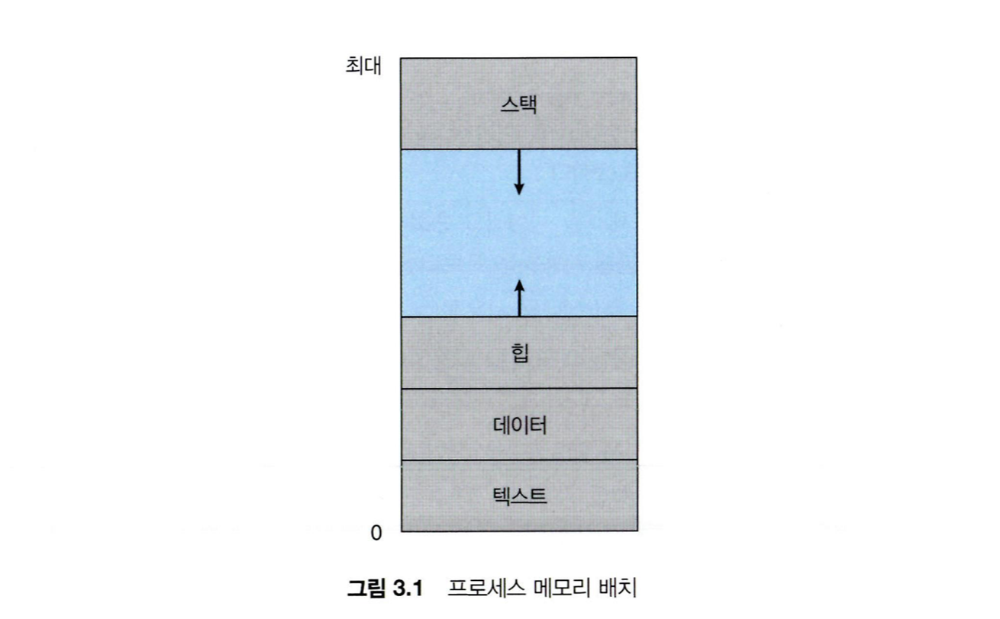

# Week 02 - OS Memory / Concurrency + Core Data Structure

---

## 제출 기준

- 필수 답변: COMMON-041 ~ COMMON-060
- 선택 답변: COMMON-061 ~ COMMON-080

---

## 필수 질문

## [COMMON-041] 프로세스 주소 공간이 어떻게 구성되는지 설명해 주세요.

답변:
- 프로세스 주소 공간은 운영체제가 각 프로세스에 제공하는 독립적인 가상 주소 공간입니다. 프로세스는 이 공간을 자신만의 연속된 메모리처럼 사용합니다.
- 사용자 영역은 일반적으로 실행할 명령어가 있는 Code(Text), 전역·정적 변수가 있는 Data/BSS, 동적 메모리를 할당하는 Heap, 공유 라이브러리와 파일 등이 연결되는 Memory-mapped 영역, 함수 호출 정보를 관리하는 Stack으로 구성됩니다.
- 일반적인 구조에서는 Heap은 높은 주소 방향으로, Stack은 낮은 주소 방향으로 확장되지만 실제 배치와 주소는 운영체제, 실행 파일 형식, ASLR 등에 따라 달라질 수 있습니다.
- 프로세스가 사용하는 가상 주소는 페이지 테이블을 통해 실제 물리 메모리에 매핑됩니다. 따라서 서로 다른 프로세스가 같은 가상 주소를 사용하더라도 서로 다른 물리 메모리를 가리킬 수 있어 프로세스 간 메모리가 보호됩니다.
- 멀티스레드 프로세스에서는 Code, Data, Heap 등을 공유하지만 각 스레드는 별도의 Stack을 가집니다.

참고 자료:
- https://learn.microsoft.com/ko-kr/windows-hardware/drivers/gettingstarted/virtual-address-spaces
- https://jutudy.tistory.com/19
- https://velog.io/@klm03025/%EC%9A%B4%EC%98%81%EC%B2%B4%EC%A0%9C-%ED%94%84%EB%A1%9C%EC%84%B8%EC%8A%A4-%EC%A3%BC%EC%86%8C-%EA%B3%B5%EA%B0%84
---

## [COMMON-042] Code, Data, Heap, Stack 영역의 역할을 설명해 주세요.

답변:
- **Code(Text) 영역**은 CPU가 실행할 기계어 명령어를 저장합니다. 실행 중에 임의로 변경되지 않도록 일반적으로 읽기 전용으로 설정되며, 같은 프로그램에서 생성된 프로세스들이 공유할 수 있습니다.
- **Data 영역**은 프로그램이 실행되는 동안 유지되는 전역 변수와 정적 변수를 저장합니다. 초기값이 있는 변수는 Data 영역, 초기화되지 않았거나 0으로 초기화되는 변수는 BSS 영역에 배치됩니다.
- **Heap 영역**은 실행 중에 크기가 결정되는 동적 메모리 공간입니다. C의 `malloc`, C++의 `new`, Java의 객체 생성 등에 사용되며, 개발자가 직접 해제하거나 가비지 컬렉터가 관리합니다.
- **Stack 영역**은 함수 호출마다 생성되는 스택 프레임을 저장합니다. 스택 프레임에는 매개변수, 지역 변수, 반환 주소 등이 포함되며, 함수가 종료되면 해당 프레임이 제거됩니다. 멀티스레드 환경에서는 각 스레드가 자신의 Stack을 가집니다.

예를 들어 Java에서 메서드 안에 선언한 기본형 지역 변수와 객체를 가리키는 참조 변수는 해당 스레드의 스택 프레임에서 관리되고, `new`로 생성한 객체는 일반적으로 Heap에서 관리됩니다.

참고 자료:
- https://zu-techlog.tistory.com/120

---

## [COMMON-043] Stack과 Heap의 차이에 대해 설명해 주세요.

답변:
- **Stack**은 함수 호출 시 생성되는 스택 프레임을 LIFO 방식으로 관리하는 영역입니다. 매개변수, 지역 변수, 반환 주소 등이 저장되며 함수가 끝나면 해당 프레임이 자동으로 제거됩니다.
- **Heap**은 실행 중에 크기와 수명이 결정되는 데이터를 동적으로 할당하는 영역입니다. C/C++에서는 개발자가 직접 해제하고, Java와 같은 언어에서는 가비지 컬렉터가 더 이상 참조되지 않는 객체를 정리합니다.
- Stack은 각 스레드마다 별도로 할당되지만 Heap은 프로세스의 여러 스레드가 공유하므로, Heap의 객체를 동시에 변경할 때는 동기화를 고려해야 합니다.
- Stack은 보통 스택 포인터를 이동하는 방식이라 할당과 해제가 빠르지만 크기가 제한적입니다. Heap은 더 크고 유연하게 사용할 수 있지만 메모리 할당이나 GC 비용, 단편화 등의 부담이 있습니다.
- 예를 들어 Java에서 `User user = new User()`를 실행하면 지역 참조 변수 `user`는 개념적으로 스택 프레임에서 관리되고, `new User()`로 생성된 객체는 Heap에서 관리됩니다.

참고 자료:
- https://jyukki.com/learning/qna/java-gc-memory-qna/

---

## [COMMON-044] Stack Overflow가 발생하는 이유를 설명해 주세요.

답변:
- 각 스레드의 Stack은 크기가 제한되어 있으며, 함수가 호출될 때마다 지역 변수, 매개변수, 반환 주소 등을 담은 스택 프레임이 추가됩니다.
- 함수 호출이 끝나기 전에 Stack의 한계를 넘을 정도로 프레임이 계속 쌓이면 Stack Overflow가 발생합니다.
- 대표적인 원인은 종료 조건이 없거나 잘못된 **무한 재귀**, 종료 조건은 있지만 입력값 때문에 발생하는 **지나치게 깊은 재귀 호출**입니다.
- C/C++에서는 함수 안에 매우 큰 지역 배열이나 변수를 선언하는 것도 Stack을 빠르게 소모할 수 있습니다. Java의 배열 객체는 Heap에 생성되지만 재귀 호출마다 생성되는 스택 프레임은 Stack을 사용합니다.
- 재귀의 종료 조건과 최대 깊이를 점검하고, 깊이가 매우 클 수 있다면 반복문이나 Heap 기반의 명시적인 자료구조로 바꾸는 것이 근본적인 해결 방법입니다. Stack 크기를 늘리는 방법은 한계를 늦출 뿐 논리 오류를 해결하지는 못합니다.

참고 자료:
- https://codehortus.tistory.com/entry/c-%EC%8A%A4%ED%83%9D-%EC%98%A4%EB%B2%84%ED%94%8C%EB%A1%9C%EC%9A%B0-%EB%B0%9C%EC%83%9D-%EB%B0%8F-%ED%95%B4%EA%B2%B0-%EB%B0%A9%EB%B2%95

---

## [COMMON-045] Memory Leak이 무엇이고, 어떤 상황에서 발생할 수 있는지 설명해 주세요.

답변:
- Memory Leak은 프로그램에서 더 이상 사용하지 않는 메모리가 해제되지 않아 계속 점유되는 현상입니다. 누수가 반복되면 사용 가능한 메모리가 줄고 잦은 GC, 성능 저하, OOM으로 이어질 수 있습니다.
- C/C++처럼 메모리를 직접 관리하는 언어에서는 `malloc`이나 `new`로 할당한 메모리를 `free`나 `delete`로 해제하지 않거나, 해제하기 전에 해당 주소를 잃어버렸을 때 발생할 수 있습니다.
- Java처럼 GC가 있는 언어에서도 객체를 더 이상 사용하지 않는데 접근 가능한 강한 참조가 남아 있으면, GC가 그 객체를 수거하지 못해 Memory Leak이 발생할 수 있습니다.
- 대표적인 예는 크기 제한이나 제거 정책이 없는 `static Map`·캐시, 컬렉션에서 제거하지 않은 객체, 해제하지 않은 리스너·콜백, 정리하지 않은 `ThreadLocal` 등입니다.
- 단순히 메모리 사용량이 높다고 모두 누수인 것은 아닙니다. Full GC 이후에도 살아 있는 객체의 크기가 계속 증가하는지 확인하고, Heap Dump를 통해 어떤 객체가 참조를 유지하는지 분석해야 합니다.

참고 자료:
- https://idkim97.github.io/2024-05-16-JAVA-heap-memory-optimization/
- https://heylj.tistory.com/4

---

## [COMMON-046] 가상 메모리가 무엇이고, 왜 필요한지 설명해 주세요.

답변:
- 가상 메모리는 실제 물리 메모리와 프로세스가 사용하는 주소 공간을 분리하여, 각 프로세스에 자신만의 크고 연속적인 메모리가 있는 것처럼 보이게 하는 메모리 관리 기법입니다.
- CPU가 생성한 가상 주소는 MMU와 페이지 테이블을 통해 실제 RAM의 물리 주소로 변환됩니다. 따라서 서로 다른 프로세스가 같은 가상 주소를 사용하더라도 서로 다른 물리 메모리를 가리킬 수 있습니다.
- 프로세스별로 독립적인 주소 공간과 접근 권한을 제공하므로 한 프로세스가 다른 프로세스나 커널의 메모리를 함부로 침범하지 못하게 보호할 수 있습니다.
- 요구 페이징을 사용하면 실행에 필요한 페이지만 RAM에 올릴 수 있어 물리 메모리보다 큰 프로그램을 실행하거나 더 많은 프로세스를 동시에 실행할 수 있습니다.
- 여러 프로세스의 가상 페이지를 동일한 물리 프레임에 매핑하여 공유 라이브러리나 공유 메모리를 효율적으로 사용할 수도 있습니다. 다만 페이지가 RAM에 없으면 Page Fault와 디스크 I/O가 발생하므로 너무 잦으면 성능이 크게 저하됩니다.

참고 자료:
- https://rebro.kr/179
- https://steady-coding.tistory.com/524

---

## [COMMON-047] 페이징이 무엇이고, 페이지와 프레임의 차이를 설명해 주세요.

답변:
- 페이징은 프로세스의 **가상 주소 공간을 고정 크기의 Page**로, 물리 메모리를 그와 같은 크기의 **Frame**으로 나누어 관리하는 방식입니다.
- Page는 가상 메모리의 논리적인 조각이고, Frame은 실제 RAM에서 Page가 들어가는 물리적인 공간입니다.
- 운영체제는 프로세스마다 페이지 테이블을 관리하며 각 가상 Page가 어느 물리 Frame에 들어 있는지 매핑합니다.
- 가상 주소는 `페이지 번호 + 오프셋`으로 나뉩니다. 페이지 테이블에서 페이지 번호를 프레임 번호로 변환하고 동일한 오프셋을 붙여 물리 주소를 구합니다.
- 각 Page를 서로 떨어진 빈 Frame에 배치할 수 있으므로 연속된 물리 메모리를 확보할 필요가 없고 외부 단편화를 없앨 수 있습니다. 다만 마지막 Page의 남는 공간으로 내부 단편화가 생길 수 있고 페이지 테이블을 위한 추가 메모리도 필요합니다.

참고 자료:
- https://steady-coding.tistory.com/524
- https://cooling.tistory.com/18

---

## [COMMON-048] Page Fault가 발생했을 때 처리 과정을 설명해 주세요.

답변:
- 요구 페이징 환경에서 CPU가 참조한 가상 Page가 현재 물리 메모리에 없으면 하드웨어가 Page Fault 예외를 발생시키고 커널의 Page Fault Handler로 제어를 넘깁니다.
- 운영체제는 먼저 해당 주소와 접근 권한이 유효한지 검사합니다. 잘못된 주소나 허용되지 않은 접근이면 프로세스에 오류 신호를 보내거나 종료하고, 정상적인 접근이지만 Page가 RAM에 없는 경우에는 적재를 진행합니다.
- 빈 Frame이 있으면 이를 사용하고, 없다면 페이지 교체 알고리즘으로 희생 Frame을 선택합니다. 희생 Page가 수정된 상태라면 디스크에 먼저 기록해야 합니다.
- 운영체제는 필요한 Page를 실행 파일이나 Swap 영역 등의 보조기억장치에서 Frame으로 읽어 옵니다. 디스크 I/O 동안 해당 프로세스는 대기 상태가 되고 CPU는 다른 프로세스를 실행할 수 있습니다.
- 적재가 끝나면 페이지 테이블을 갱신하고 관련 TLB 항목을 무효화하거나 갱신한 뒤, 중단되었던 명령어를 다시 실행합니다.

참고 자료:
- https://rebro.kr/179
- https://yonghwankim-dev.tistory.com/489

---

## [COMMON-049] TLB가 무엇이고, TLB를 사용하면 왜 주소 변환이 빨라지는지 설명해 주세요.

답변:
- TLB(Translation Lookaside Buffer)는 MMU가 사용하는 작고 빠른 하드웨어 캐시로, 최근 사용한 `가상 페이지 번호 → 물리 프레임 번호` 변환 정보를 저장합니다.
- CPU가 가상 주소를 만들면 먼저 TLB에서 가상 페이지 번호를 검색합니다. TLB Hit가 발생하면 프레임 번호를 즉시 얻어 페이지 오프셋과 결합해 물리 주소를 만들 수 있습니다.
- TLB가 없다면 메모리에 있는 페이지 테이블을 조회한 후 실제 데이터에도 접근해야 합니다. TLB Hit 시에는 페이지 테이블 조회를 생략하므로 메모리 접근 횟수가 줄어 주소 변환이 빨라집니다.
- TLB Miss가 발생하면 페이지 테이블을 탐색하여 변환 정보를 찾고 TLB에 저장합니다. **TLB Miss가 곧 Page Fault인 것은 아니며**, 페이지 테이블에도 유효한 매핑이 없거나 Page가 RAM에 없을 때 Page Fault가 발생합니다.
- 프로그램은 가까운 주소를 반복해서 사용하는 지역성을 가지므로 TLB Hit 비율이 높아지고, 작은 TLB만으로도 큰 성능 향상을 얻을 수 있습니다.

참고 자료:
- https://wansook0316.github.io/cs/os/2020/04/06/%EC%9A%B4%EC%98%81%EC%B2%B4%EC%A0%9C-%EC%A0%95%EB%A6%AC-14-%ED%8E%98%EC%9D%B4%EC%A7%95.html
- https://devyonghee.github.io/study/2022/11/21/operation-system-three-easy-pieces-17-20/

---

## [COMMON-050] 내부 단편화와 외부 단편화의 차이에 대해 설명해 주세요.

답변:
- 단편화는 메모리에 낭비되는 공간이 생기는 현상이며, 낭비 공간이 **할당된 영역 안에 있는지 밖에 있는지**에 따라 구분합니다.
- **내부 단편화**는 요청한 크기보다 큰 고정 크기 메모리 블록을 할당하여, 할당된 블록 내부에 사용하지 않는 공간이 남는 현상입니다.
- 예를 들어 Page 크기가 4KB인데 프로세스가 6KB를 요구하면 8KB를 할당해야 하므로 마지막 2KB가 내부 단편화가 됩니다.
- **외부 단편화**는 메모리의 할당과 해제가 반복되면서 할당 영역 사이에 작은 빈 공간들이 흩어지는 현상입니다. 빈 공간의 합은 충분해도 하나의 연속된 공간이 작으면 할당할 수 없습니다.
- 예를 들어 2KB, 3KB, 3KB의 빈 공간이 흩어져 있다면 총 8KB가 비어 있어도 연속된 6KB 요청을 처리할 수 없습니다.
- 페이징은 외부 단편화를 없애지만 마지막 Page에서 내부 단편화가 발생할 수 있습니다. 외부 단편화는 압축으로 줄일 수 있지만 메모리 재배치 비용이 큽니다.

참고 자료:
- https://jihunn-kim.github.io/operating_system/operating_system_8/
- https://landwhale2.github.io/os/117/

---

## [COMMON-051] 동시성과 병렬성의 차이에 대해 설명해 주세요.

답변:
- **동시성(Concurrency)**은 여러 작업이 일정 시간 동안 함께 진행되도록 여러 작업을 번갈아 다루는 구조입니다. 반드시 같은 순간에 실행되는 것은 아닙니다.
- 단일 코어에서도 운영체제가 작업을 빠르게 전환하면 여러 작업이 동시에 진행되는 것처럼 처리할 수 있으므로 동시성을 구현할 수 있습니다.
- **병렬성(Parallelism)**은 여러 코어나 프로세서가 여러 작업을 물리적으로 같은 순간에 실행하는 것입니다.
- 동시성은 주로 여러 요청의 응답성과 자원 활용도를 높이는 데 목적이 있고, 병렬성은 작업 처리 시간 단축과 처리량 향상에 목적이 있습니다.
- 한 명의 요리사가 여러 요리를 번갈아 만드는 것은 동시성이고, 여러 명의 요리사가 각각의 요리를 동시에 만드는 것은 병렬성입니다. 두 개념은 서로 배타적이지 않아 한 시스템에서 함께 사용될 수 있습니다.

참고 자료:
- https://sean-j.tistory.com/entry/%EB%8F%99%EC%8B%9C%EC%84%B1concurrency%EC%99%80-%EB%B3%91%EB%A0%AC%EC%84%B1parallelism
- https://binux.tistory.com/169

---

## [COMMON-052] Race Condition이 무엇이고, 어떤 상황에서 발생하는지 설명해 주세요.

답변:
- Race Condition은 여러 실행 주체가 공유 자원에 접근할 때 **접근 순서나 실행 타이밍에 따라 결과가 달라지는 상태**입니다.
- 둘 이상의 스레드나 프로세스가 변경 가능한 공유 자원에 동시에 접근하고, 그중 하나 이상이 쓰기 작업을 하며, 적절한 동기화가 없을 때 발생합니다.
- 예를 들어 `count++`는 읽기, 증가, 쓰기의 여러 단계로 수행됩니다. 두 스레드가 같은 값을 읽고 각각 증가시킨 뒤 같은 값을 저장하면 한 번의 증가가 사라지는 Lost Update가 발생할 수 있습니다.
- 멀티스레드의 공유 객체뿐 아니라 공유 메모리를 사용하는 프로세스, 비동기 작업, 동일한 레코드를 수정하는 데이터베이스 트랜잭션 등에서도 발생할 수 있습니다.
- Mutex, Semaphore, 원자적 연산, 트랜잭션 격리 등을 사용해 공유 자원에 대한 접근 순서와 원자성을 보장하여 예방할 수 있습니다.

참고 자료:
- https://junhyunny.github.io/information/operating-system/junit/race-condition/
- https://hudi.blog/race-condition-critical-section-mutual-exclusion/

---

## [COMMON-053] Critical Section이 무엇이고, 임계 구역 문제를 해결하기 위한 조건을 설명해 주세요.

답변:
- Critical Section은 여러 프로세스나 스레드가 공유하는 데이터에 접근하거나 이를 변경하는 **코드 영역**입니다. 동시에 실행되면 Race Condition이 발생할 수 있으므로 진입과 종료를 제어해야 합니다.
- **상호 배제(Mutual Exclusion)**: 하나의 프로세스나 스레드가 임계 구역을 실행 중이라면 다른 실행 주체는 같은 임계 구역에 진입할 수 없어야 합니다.
- **진행(Progress)**: 임계 구역을 실행 중인 주체가 없고 진입을 원하는 주체가 있다면, 누가 진입할지에 대한 결정이 무한정 미뤄져서는 안 됩니다.
- **유한 대기(Bounded Waiting)**: 어떤 주체가 진입을 요청한 뒤 허용될 때까지 다른 주체들이 먼저 진입할 수 있는 횟수에 제한이 있어야 합니다. 이를 통해 기아 상태를 방지합니다.
- 상호 배제만 만족하면 교착 상태나 기아가 발생할 수 있으므로, 올바른 해결책은 세 조건을 모두 만족해야 합니다.

참고 자료:
- https://witch.work/ko/posts/os-5
- https://lightson2323.tistory.com/88

---

## [COMMON-054] Mutex와 Semaphore의 차이에 대해 설명해 주세요.

답변:
- Mutex와 Semaphore는 모두 공유 자원의 동시 접근을 제어하는 동기화 도구입니다.
- **Mutex**는 잠금 여부를 나타내는 Lock이며, 한 번에 하나의 스레드나 프로세스만 임계 구역에 진입하도록 합니다. 일반적으로 Lock을 획득한 실행 주체만 이를 해제할 수 있는 **소유권**이 있습니다.
- **Semaphore**는 사용 가능한 자원의 수를 나타내는 정수형 카운터입니다. `wait` 연산은 사용 가능한 값이 있으면 값을 감소시켜 자원을 획득하고, 값이 0이면 대기합니다. `signal` 연산은 값을 증가시키고 대기 중인 실행 주체를 깨웁니다.
- Semaphore는 일반적으로 소유권 개념이 없어 획득한 주체가 아니어도 `signal`을 보낼 수 있습니다. 따라서 제한된 자원의 개수를 관리하거나 작업 간 실행 순서를 알리는 용도로 사용할 수 있습니다.
- 카운터가 0과 1만 가지는 Binary Semaphore는 Mutex와 비슷하게 동작할 수 있지만, 소유권과 사용 목적이 다르므로 완전히 같은 개념은 아닙니다.
- 하나뿐인 화장실 열쇠는 Mutex, 여러 칸 중 남은 칸 수를 표시하는 전광판은 Counting Semaphore에 비유할 수 있습니다.

참고 자료:
- https://jabdon4ny.tistory.com/92
- https://heeonii.tistory.com/14

---

## [COMMON-055] Deadlock이 무엇이고, 발생 조건 4가지를 설명해 주세요.

답변:
- **Deadlock(교착 상태)**은 둘 이상의 프로세스나 스레드가 서로 상대방이 가진 자원을 기다리면서 어느 쪽도 작업을 계속하지 못하는 상태입니다.
- **상호 배제(Mutual Exclusion)**: 하나의 자원을 한 번에 하나의 프로세스나 스레드만 사용할 수 있습니다.
- **점유 대기(Hold and Wait)**: 이미 자원을 보유한 상태에서 다른 자원이 해제되기를 기다립니다.
- **비선점(No Preemption)**: 다른 프로세스나 스레드가 사용 중인 자원을 강제로 빼앗을 수 없고 소유자가 직접 반납해야 합니다.
- **순환 대기(Circular Wait)**: 작업들이 원형으로 연결되어 서로 다음 작업이 가진 자원을 기다립니다.
- 네 조건이 모두 동시에 성립해야 Deadlock이 발생할 수 있습니다. 예를 들어 스레드 A가 Lock 1을 얻고 Lock 2를 기다리는 동안, 스레드 B가 Lock 2를 얻고 Lock 1을 기다리면 교착 상태에 빠질 수 있습니다.

참고 자료:
- https://lightson2323.tistory.com/89
- https://coding-zzang.tistory.com/39

---

## [COMMON-056] Deadlock을 예방하거나 회피하는 방법에 대해 설명해 주세요.

답변:
- **예방(Prevention)**은 Deadlock의 발생 조건 네 가지 중 적어도 하나가 성립하지 않도록 시스템을 설계하는 방법입니다.
- 점유 대기를 막기 위해 필요한 자원을 한꺼번에 요청하게 하거나, 추가 자원을 얻지 못하면 기존 자원을 반납한 뒤 다시 시도하게 할 수 있습니다.
- 순환 대기를 막기 위해 모든 Lock에 순서를 정하고, 모든 작업이 항상 같은 순서로만 Lock을 획득하게 할 수 있습니다.
- **회피(Avoidance)**는 자원을 요청받을 때마다 할당 후에도 모든 프로세스가 정상적으로 종료될 수 있는 **안전 상태**인지 확인하고, 안전한 경우에만 자원을 할당하는 방법입니다. 대표적으로 은행원 알고리즘이 있습니다.
- 예방은 자원 이용률과 동시성을 낮출 수 있고, 회피는 각 프로세스의 최대 자원 요구량을 미리 알아야 하며 매번 안전 상태를 계산해야 한다는 비용이 있습니다.
- 안전하지 않은 상태가 곧바로 Deadlock이라는 뜻은 아니지만, 이후 자원 요청에 따라 Deadlock으로 이어질 가능성이 있는 상태입니다.

참고 자료:
- https://studyandwrite.tistory.com/16
- https://coding-zzang.tistory.com/39

---

## [COMMON-057] Thread Safe하다는 것은 어떤 의미인지 설명해 주세요.

답변:
- **Thread Safe**란 여러 스레드가 같은 코드나 객체에 동시에 접근하더라도 데이터가 손상되지 않고 항상 의도한 결과와 일관된 상태를 유지하는 것을 의미합니다.
- 공유 가변 데이터를 보호하지 않으면 실행 순서에 따라 결과가 달라지는 Race Condition이나 메모리 가시성 문제가 발생할 수 있습니다.
- Thread Safe하게 만들기 위해 `synchronized`나 Lock으로 임계 영역을 보호하거나, 원자적 연산과 동시성 컬렉션을 사용할 수 있습니다.
- 공유 상태를 제거한 무상태 객체, 생성 후 값이 변하지 않는 불변 객체, 스레드별로 데이터를 분리하는 `ThreadLocal`도 활용할 수 있습니다.
- 예를 들어 `count++`는 읽기·증가·쓰기의 여러 단계로 실행되므로 여러 스레드가 동시에 수행하면 증가 결과가 유실될 수 있습니다. `synchronized`나 `AtomicInteger.incrementAndGet()` 등으로 이를 방지할 수 있습니다.
- Thread Safe는 주로 동시 접근의 **정확성**에 관한 개념이므로, Thread Safe한 코드라고 해서 Deadlock이나 Starvation 같은 진행성 문제까지 자동으로 방지되는 것은 아닙니다.

참고 자료:
- https://qkrtngus116.tistory.com/46
- https://youthing.tistory.com/229

---

## [COMMON-058] Hash Table이 무엇이고, 해시 충돌을 해결하는 방법을 설명해 주세요.

답변:
- **Hash Table**은 Key를 해시 함수에 넣어 얻은 해시 값을 배열의 인덱스로 사용하고, 해당 위치에 Key와 Value를 저장하는 자료구조입니다.
- 해시 값으로 저장 위치를 바로 찾기 때문에 삽입·조회·삭제의 평균 시간 복잡도는 `O(1)`이지만, 충돌이 심한 최악의 경우에는 `O(n)`까지 느려질 수 있습니다.
- 서로 다른 Key가 동일한 인덱스로 변환되는 것을 **해시 충돌(Hash Collision)**이라고 하며, 한정된 크기의 테이블을 사용하기 때문에 충돌을 완전히 없앨 수는 없습니다.
- **분리 연결법(Separate Chaining)**은 같은 인덱스로 들어온 여러 항목을 연결 리스트나 트리 등의 별도 자료구조에 함께 저장합니다.
- **개방 주소법(Open Addressing)**은 충돌 시 테이블 내부의 다른 빈 버킷을 찾아 저장하며, 선형 탐사·제곱 탐사·이중 해싱 등이 있습니다.
- 고르게 분포시키는 해시 함수를 사용하고 적재율이 높아지기 전에 테이블을 확장·재해싱하면 충돌 가능성과 성능 저하를 줄일 수 있습니다.

참고 자료:
- https://tecoble.techcourse.co.kr/post/2021-11-05-hash-hashmap/
- https://mangkyu.tistory.com/102

---

## [COMMON-059] Stack, Queue, Deque의 차이와 사용 사례를 설명해 주세요.

답변:
- 세 자료구조는 모두 선형 자료구조이며, 핵심 차이는 데이터를 어느 쪽 끝에서 넣고 꺼낼 수 있는지에 있습니다.
- **Stack**은 한쪽 끝에서만 삽입과 삭제가 일어나는 `LIFO` 구조입니다. 함수 호출 스택, 실행 취소, 괄호 검사, DFS 등에 사용합니다.
- **Queue**는 뒤에서 삽입하고 앞에서 삭제하는 `FIFO` 구조입니다. 작업 대기열, 메시지 처리, BFS 등에 사용합니다.
- **Deque(Double-Ended Queue)**는 앞과 뒤 양쪽에서 모두 삽입과 삭제가 가능합니다. Stack이나 Queue처럼 사용할 수 있고, 슬라이딩 윈도우·팰린드롬 검사 등에 활용합니다.
- 적절한 배열이나 연결 구조로 구현하면 각 끝에서의 삽입과 삭제는 일반적으로 `O(1)`이지만, 중간 원소를 탐색하거나 수정하는 용도에는 적합하지 않습니다.

참고 자료:
- https://choiiis.github.io/data-structure/basics-of-stack-queue-and-deque/
- https://dev-letter.kr/posts/stack-queue-deque

---

## [COMMON-060] Tree, Binary Tree, Binary Search Tree의 차이에 대해 설명해 주세요.

답변:
- **Tree**는 노드와 간선으로 데이터를 계층적으로 표현하는 비선형 자료구조입니다. 하나의 Root가 있고 Cycle이 없으며, Root에서 각 노드로 가는 경로가 하나만 존재합니다.
- **Binary Tree(이진 트리)**는 각 노드가 왼쪽과 오른쪽을 구분하여 최대 두 개의 자식만 가질 수 있는 Tree입니다. 자식 값의 크기에 관한 규칙은 없습니다.
- **Binary Search Tree(BST)**는 이진 트리 중에서 각 노드의 왼쪽 서브트리에는 더 작은 Key, 오른쪽 서브트리에는 더 큰 Key가 위치하도록 정렬 규칙을 적용한 구조입니다. 중복 Key의 처리 방식은 구현 정책에 따라 달라질 수 있습니다.
- BST를 중위 순회하면 Key를 정렬된 순서로 얻을 수 있으며, 균형이 잡혀 있을 때 탐색·삽입·삭제를 `O(log n)`에 수행할 수 있습니다.
- BST가 한쪽으로 치우치면 높이가 `n`에 가까워져 탐색 등이 `O(n)`까지 느려질 수 있으므로 AVL Tree나 Red-Black Tree 같은 균형 이진 탐색 트리를 사용하기도 합니다.
- 포함 관계는 `Binary Search Tree ⊂ Binary Tree ⊂ Tree`입니다.

참고 자료:
- https://menuhwang.tistory.com/47
- https://jihyeong-ji99hy99.tistory.com/412

---

## 선택 질문

## [COMMON-061] 세그멘테이션과 페이징의 차이에 대해 설명해 주세요.

답변:

참고 자료:

---

## [COMMON-062] 페이지 크기가 커지거나 작아질 때 발생하는 trade-off를 설명해 주세요.

답변:

참고 자료:

---

## [COMMON-063] Thrashing이 무엇이고, 어떻게 완화할 수 있는지 설명해 주세요.

답변:

참고 자료:

---

## [COMMON-064] 페이지 교체 알고리즘의 종류와 LRU의 동작 방식을 설명해 주세요.

답변:

참고 자료:

---

## [COMMON-065] LRU Cache를 구현한다면 어떤 자료구조를 사용할 수 있을까요?

답변:

참고 자료:

---

## [COMMON-066] 캐시 지역성이 무엇인지 시간 지역성과 공간 지역성으로 나누어 설명해 주세요.

답변:

참고 자료:

---

## [COMMON-067] 2차원 배열을 행 우선으로 탐색할 때와 열 우선으로 탐색할 때 성능 차이가 날 수 있는 이유를 설명해 주세요.

답변:

참고 자료:

---

## [COMMON-068] Spin Lock의 장점과 단점에 대해 설명해 주세요.

답변:

참고 자료:

---

## [COMMON-069] Optimistic Lock과 Pessimistic Lock의 차이를 설명해 주세요.

답변:

참고 자료:

---

## [COMMON-070] Lock-free와 Wait-free의 차이에 대해 설명해 주세요.

답변:

참고 자료:

---

## [COMMON-071] Atomic 연산이 무엇이고, 동시성 문제 해결에 어떻게 사용되는지 설명해 주세요.

답변:

참고 자료:

---

## [COMMON-072] volatile 키워드가 어떤 의미를 가지는지 설명해 주세요.

답변:

참고 자료:

---

## [COMMON-073] Thread Pool이 무엇이고, 스레드 수는 어떤 기준으로 정할 수 있는지 설명해 주세요.

답변:

참고 자료:

---

## [COMMON-074] Heap 자료구조가 무엇이고, Priority Queue와 어떤 관계가 있는지 설명해 주세요.

답변:

참고 자료:

---

## [COMMON-075] Red-Black Tree가 무엇이고, 왜 균형 이진 탐색 트리가 필요한지 설명해 주세요.

답변:

참고 자료:

---

## [COMMON-076] Graph를 인접 행렬과 인접 리스트로 표현할 때의 장단점을 설명해 주세요.

답변:

참고 자료:

---

## [COMMON-077] BFS와 DFS의 차이와 각각 적합한 상황을 설명해 주세요.

답변:

참고 자료:

---

## [COMMON-078] 정렬 알고리즘 중 Quick Sort와 Merge Sort를 비교해 주세요.

답변:

참고 자료:

---

## [COMMON-079] Stable Sort가 무엇이고, 어떤 상황에서 중요한지 설명해 주세요.

답변:

참고 자료:

---

## [COMMON-080] 대용량 데이터를 메모리에 모두 올릴 수 없을 때 정렬하는 방법을 설명해 주세요.

답변:

참고 자료:
